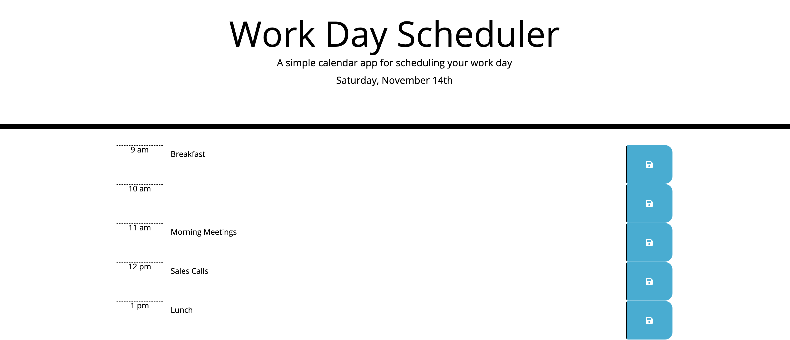

# Daily Planner

## About

This application should produce a daily planner that stores the information in localStorage and utilizes the [moment.js](https://momentjs.com/) library.

## Link

Launch [Daily Planner](https://calebthecreative.github.io/daily-planner/)

## Installation

1) Build out the time blocks in the html file using [Bootstrap](https://getbootstrap.com/) and [Fontawesome](https://fontawesome.com/).

2) Use moment() to figure out todays date and set it in the header.

3) Use moment() to figure out the hour of the day so that you can tie it to the schedule.

4) Using moment(), change the style of each time block according to whether that hour is in the past, present, or future.

5) Make sure that the save button will store the information entered into localStorage.

## Usage

1) Open the daily planner.
2) Fill out your plans for the day in the necessary time slot.
3) Press the save button to the right of your entry.

## Screenshot

